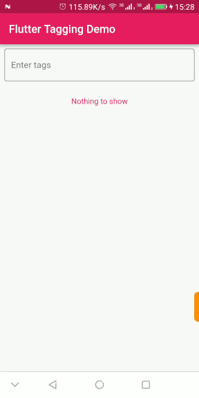

# Flutter Tagging

[](https://pub.dartlang.org/packages/flutter_tagging) [](https://github.com/sarbagyastha/flutter_tagging/blob/master/LICENSE)

A flutter package with tagging or multi-select functionality. 
Useful for adding Tag or Label Selection Forms.

 

## Usage

#### 1\. Depend

Add this to you package's `pubspec.yaml` file:

```yaml
dependencies:
  flutter_tagging: ^1.1.0
```

#### 2\. Install

Run command:

```bash
$ flutter packages get
```

#### 3\. Import

Import in Dart code:

```dart
import 'package:flutter_tagging/flutter_tagging.dart';
```

#### 4\. Using Flutter Tagging

```dart
///
/// textFieldDecoration: Adds decoration to TextField.
/// addButtonWidget: Button to be shown when new pattern is typed.
/// chipsColor: Background Color of Chips. Default is light grey.
/// chipsFontColor: Font Color of Chips. Default is black.
/// deleteIcon: Delete Icon to be included in Chips. Default is Material Cancel Icon.
/// chipsPadding: Imposes padding inside chips.
/// chipsSpacing: Defines horizontal space between chips.
/// suggestionsCallback: Callback to get suggestions as per the pattern entered.
/// onChanged: Callback to get result on data change.
///
FlutterTagging(
     textFieldDecoration: InputDecoration(
         border: OutlineInputBorder(),
         hintText: "Tags",
         labelText: "Enter tags"),
     addButtonWidget: _buildAddButton(),
     chipsColor: Colors.pinkAccent,
     chipsFontColor: Colors.white,
     deleteIcon: Icon(Icons.cancel,color: Colors.white),
     chipsPadding: EdgeInsets.all(2.0),
     chipsFontSize: 14.0,
     chipsSpacing: 5.0,
     chipsFontFamily: 'helvetica_neue_light',
     suggestionsCallback: (pattern) async {
       return await TagSearchService.getSuggestions(pattern);
       },
     onChanged: (result) {
       setState(() {
         text = result.toString();
         });
       },
),
```

For more detailed usage of properties, head on to [flutter_typeahead's documentation](https://pub.dartlang.org/documentation/flutter_typeahead/latest/).


## Example

[Example sources](https://github.com/sarbagyastha/flutter_tagging/tree/master/example)


***Credit***

This package uses [flutter_typeahead](https://pub.dartlang.org/packages/flutter_typeahead) in order to display typeahead TextField with suggestions.

Huge thanks to [@AbdulRahmanAlHamali](https://github.com/AbdulRahmanAlHamali) and team for developing Flutter Typeahead.


## License

```
Copyright 2018 Sarbagya Dhaubanjar

Licensed under the Apache License, Version 2.0 (the "License");
you may not use this file except in compliance with the License.
You may obtain a copy of the License at

   http://www.apache.org/licenses/LICENSE-2.0

Unless required by applicable law or agreed to in writing, software
distributed under the License is distributed on an "AS IS" BASIS,
WITHOUT WARRANTIES OR CONDITIONS OF ANY KIND, either express or implied.
See the License for the specific language governing permissions and
limitations under the License.
```
