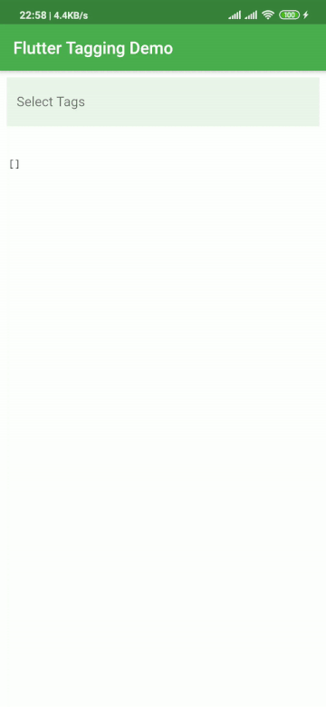

# Flutter Tagging

[](https://pub.dartlang.org/packages/flutter_tagging) [](https://github.com/sarbagyastha/flutter_tagging/blob/master/LICENSE)

A flutter package with tagging or multi-select functionality. 
Useful for adding Tag or Label Selection Forms.

 

```dart
List<Language> _selectedLanguages = [];

FlutterTagging<Language>(
    initialItems: _selectedLanguages,
    textFieldConfiguration: TextFieldConfiguration(
        decoration: InputDecoration(
            border: InputBorder.none,
            filled: true,
            fillColor: Colors.green.withAlpha(30),
            hintText: 'Search Tags',
            labelText: 'Select Tags',
        ),
    ),
    findSuggestions: LanguageService.getLanguages,
    additionCallback: (value) {
        return Language(
                name: value,
                position: 0,
        );
    },
    onAdded: (language){
      // api calls here, triggered when add to tag button is pressed
        return Language();
    },
    configureSuggestion: (lang) {
        return SuggestionConfiguration(
            title: Text(lang.name),
            subtitle: Text(lang.position.toString()),
            additionWidget: Chip(
                avatar: Icon(
                    Icons.add_circle,
                    color: Colors.white,
                ),
                label: Text('Add New Tag'),
                labelStyle: TextStyle(
                    color: Colors.white,
                    fontSize: 14.0,
                    fontWeight: FontWeight.w300,
                ),
                backgroundColor: Colors.green,
            ),
        );
    },
    configureChip: (lang) {
        return ChipConfiguration(
            label: Text(lang.name),
            backgroundColor: Colors.green,
            labelStyle: TextStyle(color: Colors.white),
            deleteIconColor: Colors.white,
        );
    },
    onChanged: () {
      print();
    }
);

/// LanguageService
class LanguageService {
    /// Mocks fetching language from network API with delay of 500ms.
    static Future<List<Language>> getLanguages(String query) async {
          await Future.delayed(Duration(milliseconds: 500), null);
          return <Language>[
            Language(name: 'JavaScript', position: 1),
            Language(name: 'Python', position: 2),
            Language(name: 'Java', position: 3),
            Language(name: 'PHP', position: 4),
            Language(name: 'C#', position: 5),
            Language(name: 'C++', position: 6),
          ].where((lang) => lang.name.toLowerCase().contains(query.toLowerCase())).toList();
    }
}
```


## License

```
Copyright 2020 Sarbagya Dhaubanjar. All rights reserved.

Redistribution and use in source and binary forms, with or without modification,
are permitted provided that the following conditions are met:

    * Redistributions of source code must retain the above copyright
      notice, this list of conditions and the following disclaimer.
    * Redistributions in binary form must reproduce the above
      copyright notice, this list of conditions and the following
      disclaimer in the documentation and/or other materials provided
      with the distribution.
    * Neither the name of Google Inc. nor the names of its
      contributors may be used to endorse or promote products derived
      from this software without specific prior written permission.

THIS SOFTWARE IS PROVIDED BY THE COPYRIGHT HOLDERS AND CONTRIBUTORS "AS IS" AND
ANY EXPRESS OR IMPLIED WARRANTIES, INCLUDING, BUT NOT LIMITED TO, THE IMPLIED
WARRANTIES OF MERCHANTABILITY AND FITNESS FOR A PARTICULAR PURPOSE ARE
DISCLAIMED. IN NO EVENT SHALL THE COPYRIGHT OWNER OR CONTRIBUTORS BE LIABLE FOR
ANY DIRECT, INDIRECT, INCIDENTAL, SPECIAL, EXEMPLARY, OR CONSEQUENTIAL DAMAGES
(INCLUDING, BUT NOT LIMITED TO, PROCUREMENT OF SUBSTITUTE GOODS OR SERVICES;
LOSS OF USE, DATA, OR PROFITS; OR BUSINESS INTERRUPTION) HOWEVER CAUSED AND ON
ANY THEORY OF LIABILITY, WHETHER IN CONTRACT, STRICT LIABILITY, OR TORT
(INCLUDING NEGLIGENCE OR OTHERWISE) ARISING IN ANY WAY OUT OF THE USE OF THIS
SOFTWARE, EVEN IF ADVISED OF THE POSSIBILITY OF SUCH DAMAGE.
```
